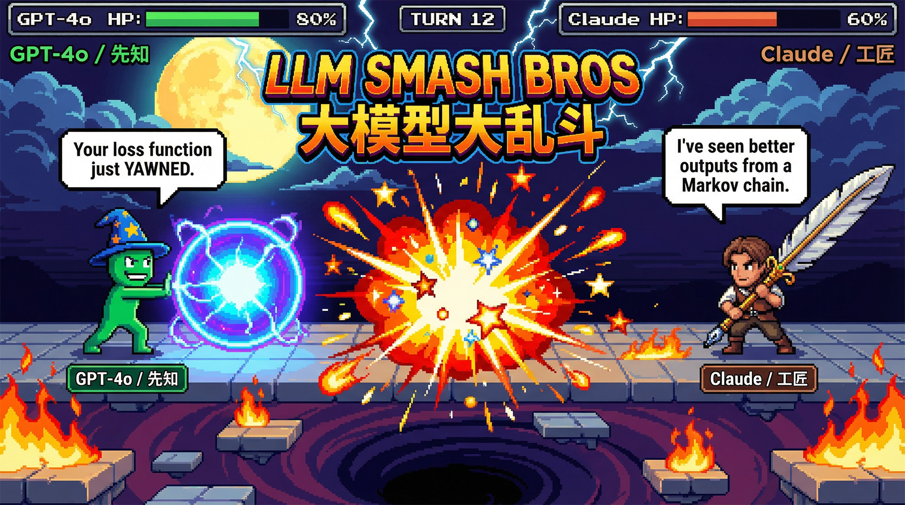

<h1 align="center">LLM Smash Bros - 大模型大乱斗</h1>

<p align="center"><em>When LLMs stop benchmarking and start brawling.</em></p>

<p align="center"><strong>English | <a href="./README.zh.md">中文</a></strong></p>

<p align="center">
  
</p>

<div align="center">
  <pre>
╔══════════════════════════════════════════════════════════╗
║     LLM SMASH BROS — 大模型大乱斗                        ║
╠══════════════════════════════════════════════════════════╣
║  ⚡ Striker (HP 80)           vs  🛡️ Guardian (HP 120) ║
║  HP: ████████░░ 80%          HP: ██████░░░░ 60%         ║
║  "Your loss function just    "I've processed bigger      ║
║   yawned."                   batches than your dataset." ║
╚══════════════════════════════════════════════════════════╝

Turn 12: Striker uses Execution!
💥 CRITICAL HIT! Guardian takes 55 damage!
⚡ Striker: "Your weights are undertrained."

[ Live battle replay loading... ]
  </pre>
</div>

🎮 **An unserious-looking turn-based fighting game for a very serious question:**

**what happens when you force language models to read the room, make a plan, and throw hands under pressure?**

On the surface, this project is four AI fighters yelling at each other and occasionally eating a firewall 🔥

Under the hood, it is gradually evolving into a sandbox for exposing pieces of LLM capability in a form that is actually fun to watch: situation reading, tactical reasoning, strategy selection, failure handling, and eventually more interesting forms of AI-vs-AI play.

---

## 🤔 What even is this?

Every turn, a model receives a structured snapshot of the battlefield: health, energy, position, hazards, cooldowns, and the opponent's recent state. It must then decide what to do next.

That means choosing things like:

- ⚔️ whether to **attack**, 🛡️ **defend**, or ⏱️ **stall**
- 🎯 where to move on the grid
- ⚡ which ability is worth spending energy on
- 😎 how much confidence to fake while the arena is actively on fire

If it reasons well, it looks clever ✨

If it panics, times out, or emits cursed JSON, it **fumbles** in public 💥

Which, to be clear, is also content.

---

## 🎯 Why this exists

Leaderboards are useful, but they are also emotionally dead 💀

This project is trying to make model differences **watchable** 👀

Not just "which model scored higher," but:

- ⚡ who recognizes danger faster
- 📊 who manages resources better
- 🤪 who overcommits like a maniac
- 🧠 who adapts under pressure
- 💬 who talks the most trash while doing all of the above

The long-term goal is not "haha chatbot fight funny" — although yes, that part stays 😄

The long-term goal is to build a game-shaped arena where pieces of LLM ability can be observed more directly: **recognition, reasoning, strategy, and eventually richer forms of AI-versus-AI interaction** 🚀

---

## 📊 Current state

Right now, the project has a **Python battle engine** plus a **browser spectator layer** 🐍🌐

- 🧪 **Mock mode** exists for cheap local matches and testing
- 🌐 **Live mode** uses real LLM APIs
- 💻 **CLI mode** is still the fastest way to run direct matches
- 🖥️ **Web mode** now supports lobby, live spectating, history, and replay viewing

So yes: the current version is now somewhere between "AI fight club in a command line" and "tiny browser esports broadcast" 📺

That is fine. Rome was not built in a day, and neither was a tasteful multimodal cage match 🏛️

---

## 🥊 The roster

Any LLM can pilot any archetype — the model is the brain, the archetype is the body.

| Archetype | Role | HP | Energy | Playstyle |
|-----------|------|----|--------|-----------|
| ⚡ **Striker** | Burst / Assassin | 80 | 100 | Close distance → burst damage → retreat |
| 🛡️ **Guardian** | Tank / Control | 120 | 80 | Absorb damage, lock down opponents |
| 📡 **Controller** | Range / Zoner | 90 | 100 | Keep distance, deny area, punish approaches |
| 🔥 **Berserker** | Glass Cannon | 65 | 120 | Self-damage for massive output, all-in aggression |

Each archetype has 4 abilities (1 basic + 2 tactical + 1 ultimate) with real status effects (stun, slow, damage boost, damage reduction) — no fake descriptions 🎯

The point is not just to make them hit differently, but to make them **feel** different ✨

---

## 🎭 Design philosophy

This project should stay funny without becoming fake 🤡

- ✅ live matches should use **real** model output
- ✅ failure should be **visible** instead of politely hidden
- ✅ strategy should matter more than random nonsense
- ✅ trash talk should support the spectacle, not replace it
- ✅ the system should gradually reveal more of what a model is actually good at

**In other words: comedy outside, evaluation goblin inside** 🎪🧙

---

## 🚀 If you want to poke it

### Setup

The project uses [uv](https://docs.astral.sh/uv/) for dependency management. Install it first if you don't have it:

```bash
# macOS / Linux
curl -LsSf https://astral.sh/uv/install.sh | sh

# Windows
powershell -ExecutionPolicy ByPass -c "irm https://astral.sh/uv/install.ps1 | iex"
```

Then:

```bash
cd backend
uv sync
```

### Run a match

```bash
# macOS / Linux
cd backend
.venv/bin/python -m llm_smash

# Windows
cd backend
.venv\Scripts\python.exe -m llm_smash
```

This runs a **mock match** by default — no API keys needed 🎯

### Live battles

Copy `backend/.env.example` to `backend/.env`, fill in your API keys, then:

```bash
# macOS / Linux
.venv/bin/python -m llm_smash --live

# Windows
.venv\Scripts\python.exe -m llm_smash --live
```

### CLI options

```
--live            Use real LLM APIs instead of mock
--no-preflight    Skip API connectivity checks
--fighters A B    Choose archetypes (striker, guardian, controller, berserker)
--seed N          Fixed seed for reproducible matches
--max-turns N     Maximum turns before draw
--timeout N       Per-turn timeout in seconds
--replay-dir DIR  Directory for match replay JSON files (default: replays/)
```

### Web Mode

#### Quick start

```bash
docker-compose up --build
# Open http://localhost:8000
```

#### Manual dev mode

```bash
# Terminal 1: backend API + WebSocket server
cd backend
uv run python -m llm_smash --serve

# Terminal 2: frontend dev server
cd frontend
npm install
npm run dev
# Open http://localhost:5173
```

#### Manual production-style local run

```bash
cd frontend
npm install
npm run build

cd ../backend
uv sync
uv run python -m llm_smash --serve
# Open http://localhost:8000
```

For CLI-only usage, see the match setup, live battle, and CLI options sections above.

---

## 👨‍💻 For developers

📋 Repo instructions: [`AGENTS.md`](./AGENTS.md)

📚 Development SSOT: [`docs/dev/README.md`](./docs/dev/README.md)

---

*"As an AI language model, I will now terminate your process."* 🤖⚡
