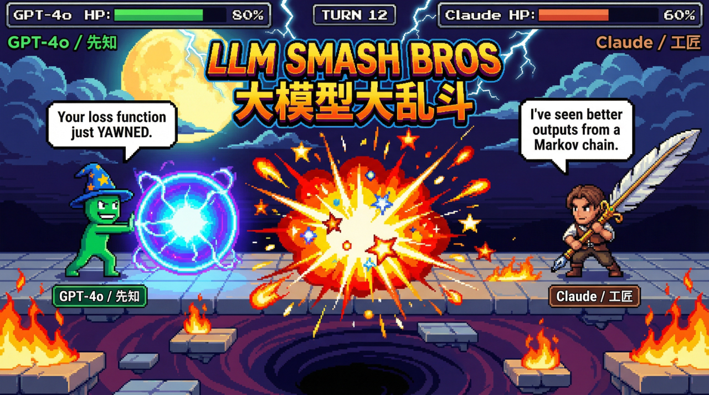

# 大模型大乱斗 - LLM Smash Bros

> 当大模型们不再卷 benchmark，开始卷拳头。

**[English](./README.md) | 中文**



<p align="center">

```
╔══════════════════════════════════════════════════════════╗
║     大模型大乱斗 — LLM SMASH BROS                        ║
╠══════════════════════════════════════════════════════════╣
║  先知 (GPT-4o)              vs  工匠 (Claude)           ║
║  血量: ████████░░ 80%        血量: ██████░░░░ 60%       ║
║  "你的损失函数刚才            "我见过比你还差的输出，
║   打了个哈欠。"               来自一个马尔可夫链。"      ║
╚══════════════════════════════════════════════════════════╝

第12回合: 先知发动系统覆写!
💥 暴击! 工匠受到 23 点伤害!
💥 失误! 工匠惊慌失措，只能防御!

[ 实时对战回放加载中... ]
```

</p>

<p align="center">

🎮 **一个看起来很不正经的回合制格斗游戏，问了一个很正经的问题：**

**当你逼大模型们读懂局势、制定计划、并在压力下互殴时，会发生什么？**

</p>

<p align="center">

表面上看，这是四个 AI 战士互相嚷嚷，偶尔还会踩到火墙上 🔥

但在底层，这个项目正在逐步进化成一个沙盒，用来暴露大模型的各种能力碎片——而且是以一种真的能看下去的形式：情境识别、战术推理、策略选择、失败处理，以及 eventually 更有趣的 AI 互殴形态。

</p>

---

## 🤔 这到底是个啥？

<p align="center">

每回合，模型会收到一个结构化的战场快照：血量、能量、位置、陷阱、技能冷却，以及对手的近期状态。然后它必须决定下一步做什么。

</p>

这意味着要选择：

- ⚔️ **进攻**、🛡️ **防御**，还是 ⏱️ **摸鱼**
- 🎯 在网格上往哪移动
- ⚡ 哪个技能值得花能量放
- 😎 当竞技场正在着火时，要假装多淡定

<p align="center">

如果它推理得好，看起来就很聪明 ✨

如果它慌了、超时了，或者吐出了诅咒 JSON，它就会当众 **失误** 💥

顺便说一句，这也是内容。

</p>

---

## 🎯 为什么存在

<p align="center">

排行榜有用，但它们在情感上是死的 💀

这个项目试图让模型差异变得 **可观看** 👀

</p>

不只是"哪个模型分数更高"，而是：

- ⚡ 谁更快识别危险
- 📊 谁更擅长资源管理
- 🤪 谁像个疯子一样过度投入
- 🧠 谁能在压力下适应
- 💬 谁在做以上所有事的同时嘴炮最多

<p align="center">

长期目标不是"哈哈聊天机器人打架真搞笑"——虽然是的，这部分会保留 😄

长期目标是构建一个游戏形态的竞技场，让大模型的能力碎片能被更直接地观察：**识别、推理、策略，以及 eventually 更丰富的 AI 互殴形态** 🚀

</p>

---

## 📊 当前状态

<p align="center">

现在，真实存在的东西是 **Python CLI 对战引擎** 🐍

</p>

- 🧪 **Mock 模式** 存在，用于便宜的本地对战和测试
- 🌐 **Live 模式** 使用真实的大模型 API
- 💻 当前界面是终端优先
- 🎨 未来的观众层（GUI / 动画 / 直播 theatrics）还在开发中

<p align="center">

所以是的：当前版本更接近"命令行里的 AI 搏击俱乐部"，而不是"完整的电竞直播" 📺

没关系。罗马不是一天建成的，tasteful 的多模态笼斗也不是 🏛️

</p>

---

## 🥊 选手阵容

<p align="center">

当前选手包括：

</p>

| 选手 | 模型 | 定位 |
|---------|-------|------|
| 🔮 **先知** | GPT-4o | 平衡 / 控制 |
| 🎨 **工匠** | Claude 3.5 Sonnet | 迅捷 / 精准 |
| 👁️ **观察者** | Gemini 1.5 Pro | 坦克 / 耐心 |
| 🐝 **蜂群** | Llama 3 | 狂战士 / 狂野 |

<p align="center">

每个都被设计成既是战斗套件，也是人格笑话 🤡

重点不只是让它们打起来不一样，而是让它们 **感觉** 不一样 ✨

</p>

---

## 🎭 设计理念

<p align="center">

这个项目应该保持有趣，但不变得虚假 🤡

</p>

- ✅ 实时对战应该使用 **真实** 模型输出
- ✅ 失败应该 **可见**，而不是被礼貌地隐藏
- ✅ 策略应该比随机 nonsense 更重要
- ✅ 嘴炮应该支持 spectacle，而不是取代它
- ✅ 系统应该逐步揭示模型真正擅长什么

<p align="center">

**换句话说：外面是喜剧，里面是评估地精** 🎪🧙

</p>

---

## 🚀 如果你想戳戳它

<p align="center">

当前入口：

</p>

```bash
cd backend
python -m llm_smash
```

<p align="center">

默认运行 mock 对战 🎯

</p>

对于实时对战，配置 `backend/.env` 然后运行：

```bash
cd backend
python -m llm_smash --live
```

---

## 👨‍💻 开发者

<p align="center">

📋 仓库指南：[AGENTS.md](./AGENTS.md)

📚 开发 SSOT：[docs/dev/README.md](./docs/dev/README.md)

</p>

---

<p align="center">

*"作为一个人工智能语言模型，我现在将终止你的进程。"* 🤖⚡

**—— GPT-4o，大概**

</p>